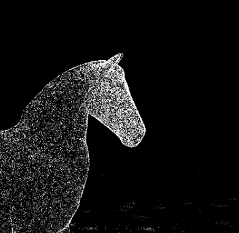
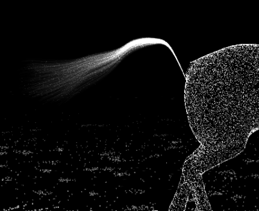
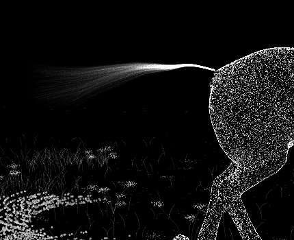

# Visual and runtime validation

Validated October 4, 2026 against the production build in Chromium. The artwork retains a detailed authored equine surface, a 0.9-second gallop, attached fiber shading, a pure black background, and no visible words or controls.

Four anatomical hoof tracks gate sand forces to contact phases. A bounded 24-impact pool displaces the advected bed and emits short ballistic sprays. Six peripheral white wind streams share the gust/curl field used by sand and displaced horse particles.

Hover pulls local particle streams away from moving anatomical anchors. A damped GPU spring restores them; offsets are capped at 0.8 rendering units and velocities at 8 units/second. Separate attached and scattered passes preserve volume while keeping detached particles visible. The camera follows a restrained 20-second arc, supports damped dragging, and returns after three seconds idle. Touch taps disturb; touch drags steer.

## Checkpoint 8 verification

- 50 unit/integration tests pass. Coverage across generation, gait interpolation, force/contact logic, spring dynamics, camera motion and wind generation is 99.64% statements, 99.12% branches, and 100% functions/lines; every configured threshold exceeds 80%.
- 14 production browser tests pass: wordless startup, resize, portrait framing, hidden-tab pause/resume, context restoration, adaptive GPU submissions/resolution, visible ground travel, bounded hoof impulses, mouse/drag behavior, reduced-motion stillness and recovery, measurable GPU scattering/reassembly, native touch gestures, and forced analytic fallback without floating-point render targets.
- GPU readback verifies visible displacement and complete return. Return checks wait two seconds of scene time, avoiding a wall-time assumption on very slow software-rendered CI machines.
- Fixed 60 Hz simulation sleeps when settled and skips inactive particle prefixes after quality adaptation. Wind and spray decrease more aggressively than anatomical point counts. Reduced-motion and context-restoration paths reset the simulation before drawing.
- Type checking/build pass; full dependency audit reports zero vulnerabilities. Final read-only code/security review found no remaining material issues.
- Desktop, portrait and 3840×2160 frames rendered without shader or runtime errors. The motion recording shows gallop, interaction, reassembly and camera dragging.

## Checkpoint 8 rendering observations

Each profile warmed up for six seconds, then ran for six seconds. Continuous-hover measurements repeatedly disturbed the horse throughout both periods. Rates use actual wall-clock time with adaptive quality active.

The browser reported **ANGLE / Vulkan SwiftShader**, a software renderer, rather than the physical GPU. Portrait uses browser emulation, not a physical phone. Desktop approaches the 60 fps target; both portrait profiles exceed the 30 fps target. These are local observations, not universal performance guarantees.

| Profile | Viewport | Initial device ratio | Mean fps | Horse particles at end | Quality at end |
| --- | --- | --- | --- | --- | --- |
| desktop idle | 1440×1000 | 1 | 58.06 | 100,100 | 0.715 |
| desktop continuous hover | 1440×1000 | 1 | 58.09 | 56,700 | 0.405 |
| portrait idle | 390×844 | 2 | 60.04 | 68,000 | 1.000 |
| portrait continuous hover | 390×844 | 2 | 50.71 | 68,000 | 1.000 |

Raw observations: [performance.json](performance.json). Motion preview: [preview.mp4](preview.mp4).

## Visual evidence

## Checkpoint 9 — sculptural sand

Three seeded depth bands replace the uniform floor. Two thirds of grains cluster into small patches; shallow coherent terrain contours remain below the calibrated hoof corridor. The vertex shader preserves these sampled heights rather than flattening them. Foreground grains retain sharp cores and stronger perspective size.

Four immutable contact events per authored stride drive bounded coarse eruptions, softer dust, propulsion pressure, and fading advected tracks. CPU and GPU spray trajectories share ascent, gravity, landing and ground travel. Developer diagnostics expose the layers, strike count and active spray; the canvas stays wordless.

77 unit/integration tests pass with 98.79% statements, 95.50% branches and 100% lines. Sand and force logic have 100% coverage. Production startup, responsive framing, reduced motion, hidden tabs, context recovery, adaptive quality and ground-travel browser checks pass. The checkpoint includes tested face, hair and audio foundations for subsequent integration.

## Checkpoint 10 — facial detail and strand tail

The face has locally refined muzzle, jaw and ear geometry, denser deterministic sampling, eye/nostril recess masks and localized highlights. Body fiber shading fades out across the facial region. Sharper white particle cores retain a small halo, and adaptation preserves at least 84.85% of the capped drawing ratio.

868 source-tail vertices are excluded from both surface sampling and the depth topology. A nine-point animated guide drives 640 seeded tapered strands, rendered as fine connected filaments with particle highlights. Roots follow the moving source attachment; delayed tips respond to gravity, shared wind and the existing pointer field. Hair consumes the body's shared force uniforms without overwriting its release decay.

## Checkpoint 11 — synchronized recorded sound

The same immutable strike events now trigger isolated recorded hoof transients, sand scrapes and settling grit. Variant selection and small rate changes avoid an unrelated audio loop. Gain limiting and restrained camera-relative stereo keep the horse weighted and the grain bed quiet. Click, tap or drag activates playback; M toggles mute. Hidden tabs, reduced motion and context loss stop and release voices, and resume consumes only current contacts. Pre-activation mute is preserved; missing samples leave the renderer usable.

80 unit/integration tests and 20 production browser checks pass. Core coverage is 98.71% statements, 95.59% branches, 96% functions and 100% lines. The additional browser checks cover audio activation, mute, touch, loading failure, pause/recovery and distinct automatic strikes on all four tracks. Dependency audit reports zero vulnerabilities. Read-only code/security reviews found no material blockers.

The final floor shader skips contact calculations outside the affected corridor and uses the already seeded clusters for variation, preserving terrain, grain counts and coarse strikes. Quality adaptation also thins complete tail strands while retaining at least 60% of them. The sparkle resolution floor remains intact.

### Final rendering measurements

Apple M3 Pro, 12-core CPU, 36 GB RAM; headless Chromium 153 with ANGLE Metal on the physical Apple GPU. Each profile warmed for six seconds and was measured for six seconds with recorded sound active. Heavy hover repeatedly disturbed the horse throughout. Portrait remains browser emulation rather than a physical phone test.

| Profile | Viewport / device ratio | Mean fps | Horse particles | Quality |
| --- | --- | --- | --- | --- |
| desktop idle | 1440×1000 / 1 | 59.94 | 140,000 | 1.000 |
| desktop continuous hover | 1440×1000 / 1 | 59.98 | 140,000 | 1.000 |
| portrait idle | 390×844 / 2 | 59.97 | 68,000 | 1.000 |
| portrait continuous hover | 390×844 / 2 | 59.98 | 68,000 | 1.000 |

All four Metal profiles ran at approximately 60 fps at full anatomical density with no runtime/shader errors. [Exact source hashes and raw Metal observations](performance-11.json) identify the measured runtime. The separate [software-renderer observations](performance-11-software.json) are slower (24.63–54.08 fps); the desktop 60 fps target is not met by that CPU-rendering path. These are measured local profiles, not a claim about all devices.

### Audiovisual and close-detail evidence

The ten-second [preview with recorded sound](preview.mp4) contains natural gallop, hover scattering, recovery and camera dragging. The capture reports 44 sound impacts for 44 visual strikes. Decoded stereo audio peaks at -8.00 dBFS, with no clipped, nonfinite or invalid samples. [Capture and mix measurements](audio-measurements.json) preserve the counts and levels. The face, flowing tail and four successive gait frames were reviewed visually on desktop and portrait; the tail guide root is now attached exactly to the preserved moving body cap, eliminating the small source-guide gap.

Subjective listening was unavailable in this agent session. The capture verifies synchronized scheduling and unclipped recorded output; naturalness and timbre are not claimed as listening-verified. Source recording provenance remains in [audio-sources.md](audio-sources.md).

## Checkpoint 12 — cleaner meadow, connected tail and contact sound

The floor now reads as short white particle grass, with larger tilted five-petal flowers and low bushes formed from leaf clusters. A quarter of flowers occupy the hoof corridor; a sixth of bushes line its edges. Seeded coverage mixes clumps and open grass. Nearby plants flatten under the shared strike field, then recover as the terrain moves backward. Plant roots stay fixed to their moving terrain, and the meadow consumes the same wind field as the other particles. Quiet fine ground grains replace the previously dominant bright sand bed.

Sole height now follows the lowest sampled hoof vertex rather than the center of the hoof volume. A descending threshold crossing triggers one strike per hoof per 0.9-second stride. Audio and visual kicks use this shared event. Stronger short ballistic launches clear the grass canopy, then land in the bounded grain pool.

Inspection showed vertex 8430 was a side hindquarter cap rather than the central tail dock. The corrected guide attaches to body vertex 10, keeps its proximal curve close to the croup, and spreads roots across a small bundle. The hair shares a nearby body particle’s GPU displacement, sampled within the guaranteed active prefix, so scattering keeps the attachment together. Its analytic fallback remains bounded.

Recorded hoof attacks now last 130 ms, grain releases 170 ms, with rates near their original recording speed. The low-mid hoof resonance is reduced; the slow-pitched third scrape and 0.28-rate bed are removed. The much quieter high-passed original-speed air bed leaves more space between impacts. [Exact source edits and provenance](audio-sources.md) retain the original CC0 attribution. The ten-second recording contains 44 audible impacts for 44 visual strikes; peak -9.97 dBFS, RMS -32.92 dBFS, with no clipping or nonfinite samples. [Audio measurements](audio-measurements-12.json) preserve these observations. Subjective listening remains unverified in this agent session.

95 unit/integration tests and 21 production browser checks pass. Coverage is 98.88% statements, 95.13% branches, 96.89% functions and 100% lines. Tests include planted roots, deterministic plants, readable blossom geometry, hoof-route distribution, bending bounds/recovery, central dock continuity, sole contact timing, higher bounded launches, short recorded PCM attacks, touch/audio/resize/reduced-motion/context lifecycles and reassembly. Dependency audit reports zero vulnerabilities. Read-only review found no material blockers.

### Current Metal performance

Apple M3 Pro, 12-core CPU, 36 GB RAM, headless Chromium 153 using the physical GPU through ANGLE Metal. Each profile warmed for 6 seconds, then measured 6 seconds with sound active. Portrait is browser viewport emulation, not a physical phone.

| Profile | Viewport / ratio | Mean fps | Horse particles | Quality |
| --- | --- | --- | --- | --- |
| desktop idle | 1440×1000 / 1 | 59.95 | 140,000 | 1.000 |
| desktop continuous hover | 1440×1000 / 1 | 59.96 | 140,000 | 1.000 |
| portrait idle | 390×844 / 2 | 59.96 | 68,000 | 1.000 |
| portrait continuous hover | 390×844 / 2 | 59.96 | 68,000 | 1.000 |

[Raw measurements and source hashes](performance-12.json). The results meet the local 60 fps desktop and 30 fps portrait targets; no claim is made about all devices. [Current audiovisual preview](preview.mp4) shows the moving meadow, kicks, tail, scattering and camera drag.

## Checkpoint 13 — clean strand tail

The tail uses normal alpha filaments, a smooth immediately opening strand bundle, and sparse highlight grains rather than additive accumulation. Roots retain the central croup attachment and body wake coupling. Seven hair checks pass, including proximal spread and anchored root continuity; the production build passes and the desktop frame was inspected. Seeded botanical sampling and bounded brush primitives land as tested infrastructure for the next checkpoints so their preceding RED tests remain green.

## Checkpoint 14 — depth-aware sculptural cursor

An eight-segment world-space brush now picks the animated horse triangles or procedural ground instead of a flat plane. Sweeps apply bounded directional and curling forces with depth attenuation; surface transitions, misses, and long jumps reset continuity. GPU inputs reject invalid segments. Hair consumes the identical history and its analytic roots match horse fallback displacement. Eight targeted browser checks pass for actual surface selection, restoration, dragging, touch, reduced motion, and float-target fallback. Earlier automatic four-hoof strike regression is retained.
