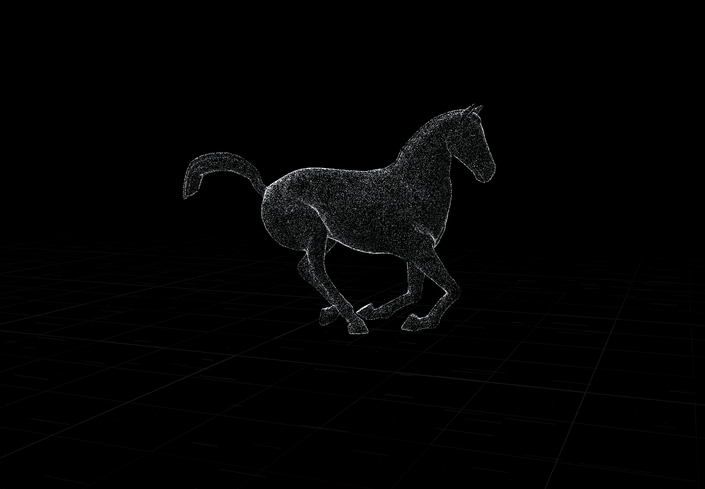
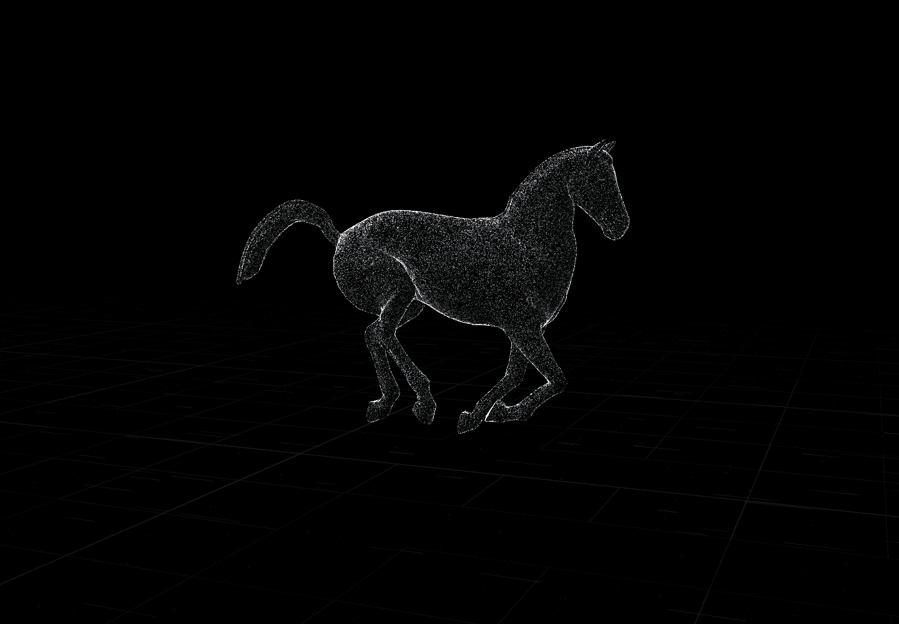
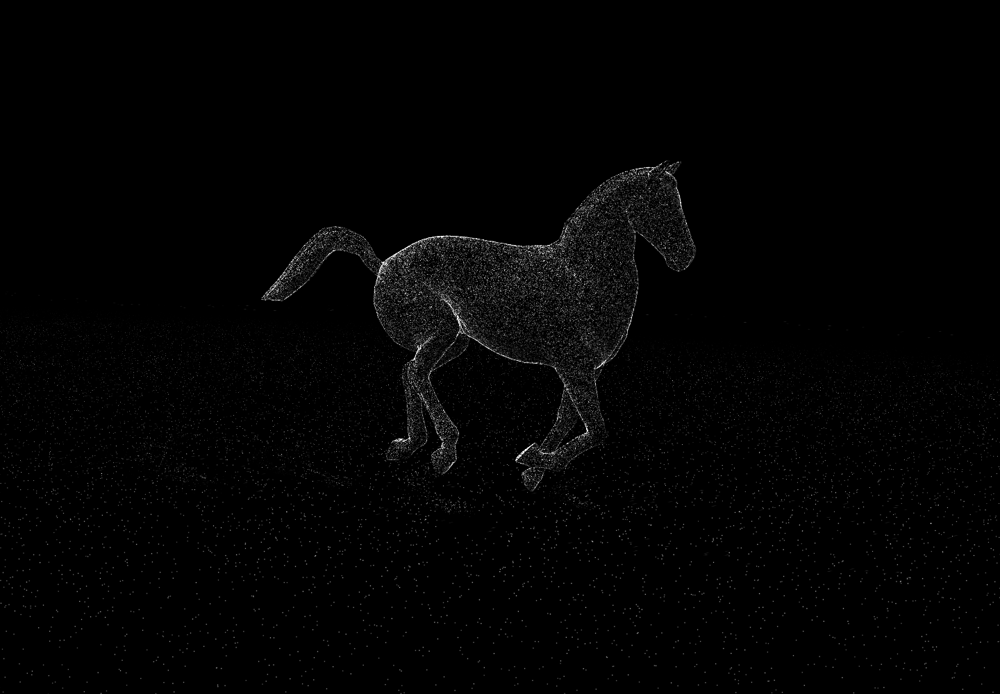
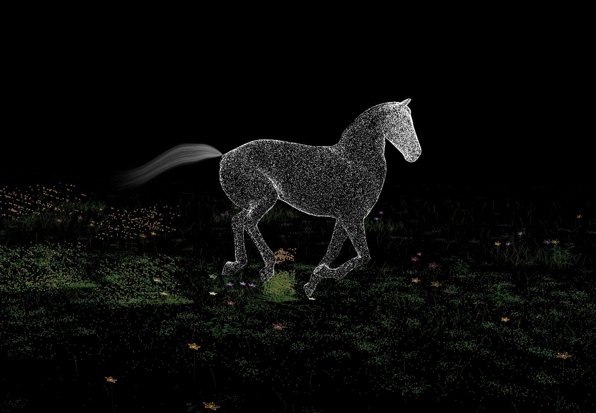
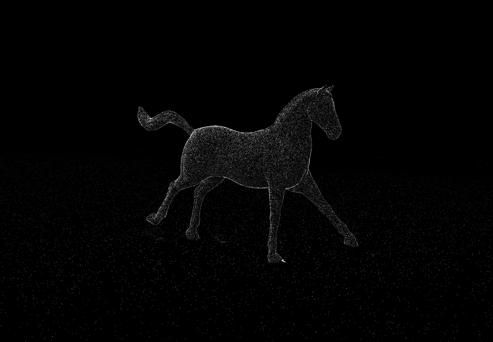
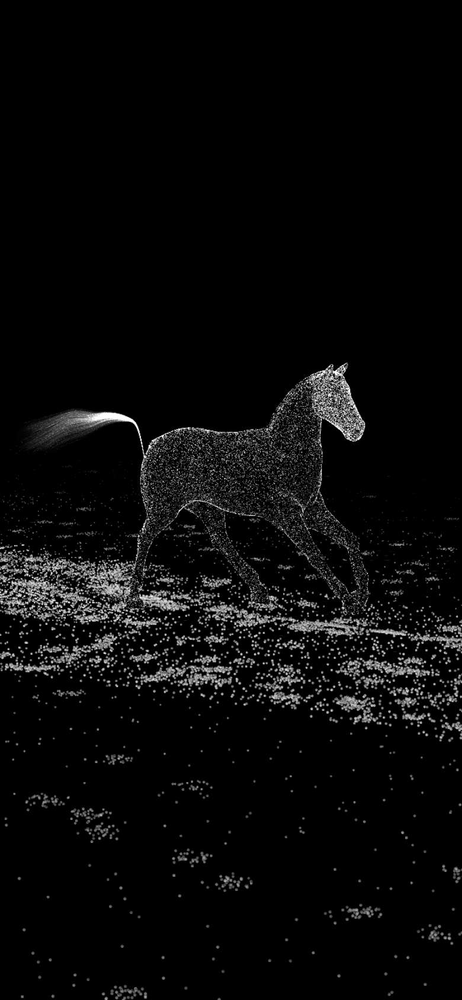
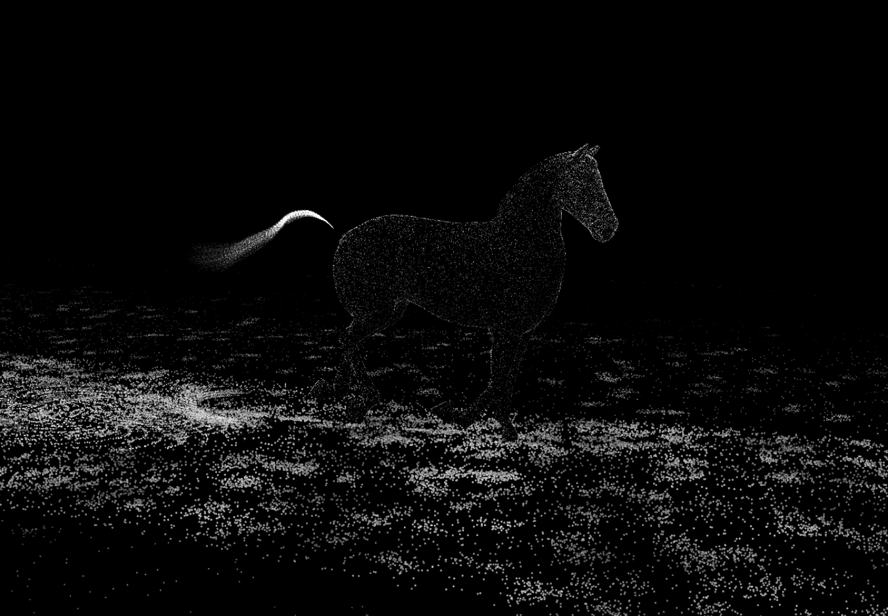
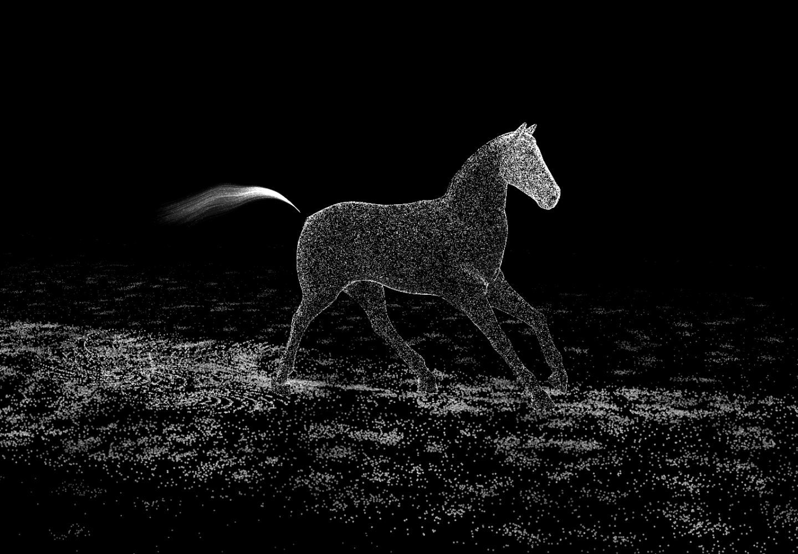

# Visual and runtime validation

Validated October 4, 2026 against the production build in Chromium. The artwork retains a detailed authored equine surface, a 0.9-second gallop, attached fiber shading, a pure black background, and no visible words or controls.

Four anatomical hoof tracks gate sand forces to contact phases. A bounded 24-impact pool displaces the advected bed and emits short ballistic sprays. Six peripheral white wind streams share the gust/curl field used by sand and displaced horse particles.

Hover pulls local particle streams away from moving anatomical anchors. A damped GPU spring restores them; offsets are capped at 0.8 rendering units and velocities at 8 units/second. Separate attached and scattered passes preserve volume while keeping detached particles visible. The camera follows a restrained 20-second arc, supports damped dragging, and returns after three seconds idle. Touch taps disturb; touch drags steer.

## Verification

- 50 unit/integration tests pass. Coverage across generation, gait interpolation, force/contact logic, spring dynamics, camera motion and wind generation is 99.64% statements, 99.12% branches, and 100% functions/lines; every configured threshold exceeds 80%.
- 14 production browser tests pass: wordless startup, resize, portrait framing, hidden-tab pause/resume, context restoration, adaptive GPU submissions/resolution, visible ground travel, bounded hoof impulses, mouse/drag behavior, reduced-motion stillness and recovery, measurable GPU scattering/reassembly, native touch gestures, and forced analytic fallback without floating-point render targets.
- GPU readback verifies visible displacement and complete return. Return checks wait two seconds of scene time, avoiding a wall-time assumption on very slow software-rendered CI machines.
- Fixed 60 Hz simulation sleeps when settled and skips inactive particle prefixes after quality adaptation. Wind and spray decrease more aggressively than anatomical point counts. Reduced-motion and context-restoration paths reset the simulation before drawing.
- Type checking/build pass; full dependency audit reports zero vulnerabilities. Final read-only code/security review found no remaining material issues.
- Desktop, portrait and 3840×2160 frames rendered without shader or runtime errors. The motion recording shows gallop, interaction, reassembly and camera dragging.

## Sustained rendering observations

Each profile warmed up for six seconds, then ran for six seconds. Continuous-hover measurements repeatedly disturbed the horse throughout both periods. Rates use actual wall-clock time with adaptive quality active.

The browser reported **ANGLE / Vulkan SwiftShader**, a software renderer, rather than the physical GPU. Portrait uses browser emulation, not a physical phone. Desktop approaches the 60 fps target; both portrait profiles exceed the 30 fps target. These are local observations, not universal performance guarantees.

| Profile | Viewport | Initial device ratio | Mean fps | Horse particles at end | Quality at end |
| --- | --- | --- | --- | --- | --- |
| desktop idle | 1440×1000 | 1 | 58.06 | 100,100 | 0.715 |
| desktop continuous hover | 1440×1000 | 1 | 58.09 | 56,700 | 0.405 |
| portrait idle | 390×844 | 2 | 60.04 | 68,000 | 1.000 |
| portrait continuous hover | 390×844 | 2 | 50.71 | 68,000 | 1.000 |

Raw observations: [performance.json](performance.json). Motion preview: [preview.mp4](preview.mp4).

## Visual evidence

## Checkpoint 9 — sculptural sand

Three seeded depth bands replace the uniform floor. Two thirds of grains cluster into small patches; shallow coherent terrain contours remain below the calibrated hoof corridor. The vertex shader preserves these sampled heights rather than flattening them. Foreground grains retain sharp cores and stronger perspective size.

Four immutable contact events per authored stride drive bounded coarse eruptions, softer dust, propulsion pressure, and fading advected tracks. CPU and GPU spray trajectories share ascent, gravity, landing and ground travel. Developer diagnostics expose the layers, strike count and active spray; the canvas stays wordless.

77 unit/integration tests pass with 98.79% statements, 95.50% branches and 100% lines. Sand and force logic have 100% coverage. Production startup, responsive framing, reduced motion, hidden tabs, context recovery, adaptive quality and ground-travel browser checks pass. The checkpoint includes tested face, hair and audio foundations for subsequent integration.

## Checkpoint 10 — facial detail and strand tail

The face has locally refined muzzle, jaw and ear geometry, denser deterministic sampling, eye/nostril recess masks and localized highlights. Body fiber shading fades out across the facial region. Sharper white particle cores retain a small halo, and adaptation preserves at least 84.85% of the capped drawing ratio.

868 source-tail vertices are excluded from both surface sampling and the depth topology. A nine-point animated guide drives 640 seeded tapered strands, rendered as fine connected filaments with particle highlights. Roots follow the moving source attachment; delayed tips respond to gravity, shared wind and the existing pointer field. Hair consumes the body's shared force uniforms without overwriting its release decay.

